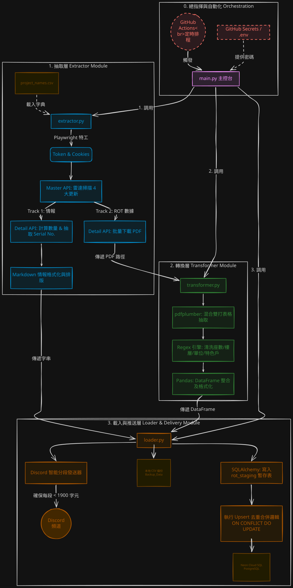
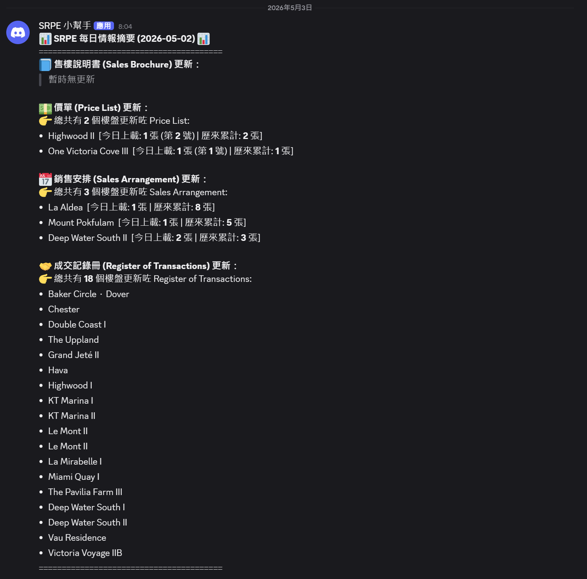
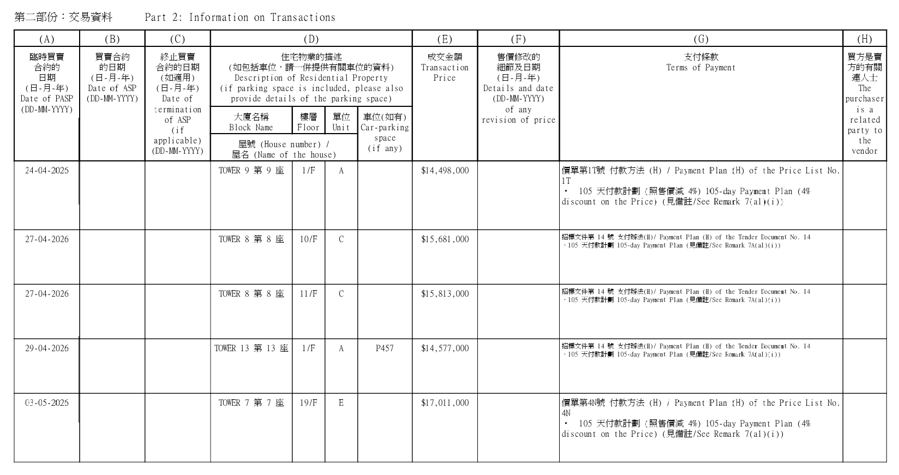
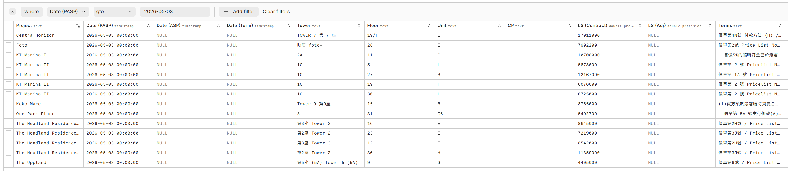
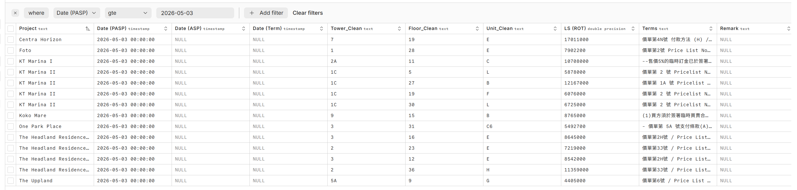

# 📡 SRPE Intelligence Radar & Automated ETL Pipeline

An end-to-end automated data pipeline that monitors, scrapes, parses, and databases the Sales of First-hand Residential Properties Electronic Platform (SRPE) in Hong Kong. It delivers real-time intelligence reports to Discord and maintains a clean transaction database in Cloud SQL.

## 📖 Project Overview
本項目旨在自動化追蹤香港一手住宅物業市場的最新動態。系統包含兩大核心引擎：
1. **情報雷達 (Intelligence Radar)**：每日自動掃描過去 24 小時內上載的四類核心文件 (售樓說明書、價單、銷售安排、成交記錄冊)，並透過 Discord 推送高管級摘要報告。
2. **ETL 數據管線 (ETL Data Pipeline)**：自動下載最新的「成交記錄冊 (ROT)」PDF，進行深度清洗與結構化轉換，最終透過 Upsert 邏輯寫入 PostgreSQL 雲端數據庫。

## ✨ Key Features
* **☁️ 全自動化 CI/CD 部署 (New)**：利用 GitHub Actions 設定 Cron Job，每日清晨自動運行，無需手動介入，並自動將 CSV 備份存檔為 Artifacts。
* **🗄️ Cloud SQL 數據庫整合 (New)**：透過 `SQLAlchemy` 連接 Neon Serverless Postgres，內置 `ON CONFLICT DO UPDATE` 邏輯，確保數據去重及精準更新。
* **🧩 模組化架構 (New)**：嚴格遵循 Software Engineering 標準，將系統分拆為 `extractor` (抽取)、`transformer` (轉換) 及 `loader` (載入) 三大獨立模組。
* **🔐 自動化權限獲取**：利用 `playwright` 模擬無頭瀏覽器，自動處理並繞過政府網站的免責聲明頁面以獲取 API Token 及 Session。
* **🤖 智能 PDF 數據提取**：深度定制 `pdfplumber`，獨創「混合雙打抽取法 (Hybrid Strategy)」解決政府 PDF 格式不一的問題。
* **✉️ Discord 智能分段推送**：內置分段發送器 (Message Chunker)，完美繞過 Discord 的 2000 字元限制。

## 📝 Architecture Diagram

## 🛠️ Tech Stack
* **Language:** Python 3.10
* **Data Processing:** `pandas`, `pdfplumber`, `re` (Regular Expressions)
* **Database & ORM:** `sqlalchemy`, `psycopg2-binary`, Neon PostgreSQL
* **Web Scraping:** `requests`, `playwright`, `asyncio`
* **DevOps & Security:** GitHub Actions, `python-dotenv`

## 🚀 Quick Start

1. **Clone the repository:**
git clone https://github.com/yourusername/srpe-intelligence-radar.git
cd srpe-intelligence-radar

2. **Install dependencies:**
pip install -r requirements.txt

3. **Install Playwright browsers (Required for Extractor):**
playwright install chromium

4. **Environment Setup:**
- 複製 `.env.example` 並重新命名為 `.env`。
- 填入您的 `DATABASE_URL` (選填，若留空將進入 Mock 模式以展示清洗邏輯)。

5. **Run the pipeline:**
python main.py

## 📊 Sample Outputs
### 1. Real-time Intelligence Delivery (Discord)
系統會將 API 掃描結果轉化為易讀的 Markdown 報告，並透過 Webhook 實時推送至指定頻道，方便管理層在手機隨時查閱。

### 2. Structured Cloud Database (PostgreSQL)
ETL 管線會將非結構化的 PDF 買賣合約，清洗並正規化 (Normalize) 為關聯式數據，支援後續的 BI 分析及機器學習。

#### 2.1 Source ROT PDF (e.g., Centra Horizon)

#### 2.2 Raw Data Extraction (Pre-transformation)

#### 2.3 Final Structured Database (Post-normalization)

## 🗺️ Next Steps
- [ ] **BI 視覺化儀表板**：連接 PowerBI 或 Tableau，將 Cloud SQL 內的成交數據轉換為實時數據圖表供管理層參考。
- [ ] **NLP 支付條款解析**：運用 Text Mining 萃取價單「支付條款 (Terms)」內的實際折實價 (Net Price) 及折扣率。
- [ ] **機器學習預測**：利用累積的歷史銷售數據，建立迴歸模型分析影響一手物業去貨率的關鍵特徵。
