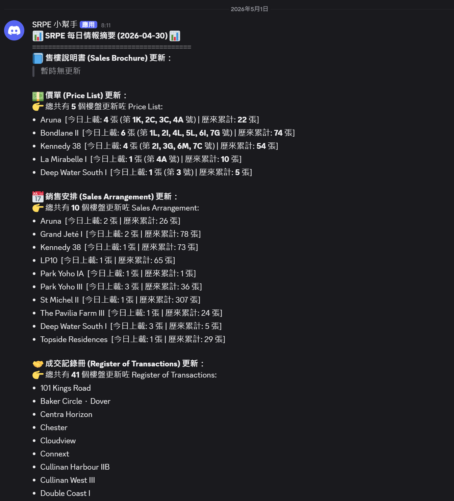

# 📡 SRPE Daily Intelligence Radar (一手住宅物業銷售資訊雷達)


An automated End-to-End data pipeline that monitors, scrapes, and parses the Sales of First-hand Residential Properties Electronic Platform (SRPE) in Hong Kong, delivering real-time Discord alerts and structured Excel reports daily.

## 📖 項目簡介 (Project Overview)
本項目旨在自動化追蹤香港一手住宅物業市場的最新動態，為定價團隊 (Pricing Team) 及管理層提供極速的市場情報。系統採用「大一統模組化 (Mono-Repo)」設計，每日自動處理繁瑣的政府 PDF 文件。

## ✨ 核心模組 (Core Modules)

**1. 🔔 每日情報通知雷達 (`main_radar.py`)**
* **實時監控**：每日掃描 SRPE 網站，追蹤 24 小時內更新的四大類文件 (SB, PL, SA, ROT)。
* **Discord 智能推送**：自動排版並透過 Webhook 將摘要推送到群組，內置分段發送器完美繞過 2000 字元限制。

**2. 🧹 每日成交數據處理器 (`main_etl.py`)**
* **自動化下載 (Extract)**：利用 `playwright` 模擬無頭瀏覽器，自動處理並繞過政府網站免責聲明獲取 Token，批量下載目標樓盤的成交紀錄冊 PDF。
* **高階數據清洗 (Transform)**：
  * 深度定制 `pdfplumber`，獨創「混合雙打抽取法 (Hybrid Strategy)」解決表格漏畫底線問題。
  * 構建強大的 Regex 引擎，精準拆解「子母座」、智能縮寫「洋房/別墅」，並強行攔截「特色戶 (Simplex/Duplex)」等極端排版。
* **自動化報表 (Load)**：一鍵將雜亂無章的 PDF 轉換為高管級別、自動調整欄寬的 Excel `ROTs_{yesterday}.xlsx`。

## 📝 系統架構 (Architecture Diagram)


## 📊 報告輸出範例 (Sample Output)

推送至 Discord 的實時情報會自動套用 Markdown 格式，清晰區分各類文件及上載詳情：



## 🛠️ 技術棧 (Tech Stack)
* **Language:** Python
* **Web Scraping:** `playwright`, `requests`, `asyncio`
* **Data Engineering:** `pandas`, `pdfplumber`, `re` (Regular Expressions)
* **Output & Notification:** `xlsxwriter`, Discord Webhooks

## 🚀 關於源代碼 (About Source Code)
> **⚠️ 櫥窗展示聲明 (Showcase Notice)**
> 為保護商業價值及防止濫用，本 Repository 內的 `main_radar.py` 及 `main_etl.py` 為展示系統架構與代碼風格的閹割版 (Teaser Version)。核心的反爬蟲繞過機制及 PDF 清洗 Regex 已被隱藏。
> **歡迎在面試中進一步探討完整的技術細節與數據工程思維。**

### 環境設定 (Configuration)
```bash
pip install requests playwright pdfplumber nest_asyncio pandas xlsxwriter
playwright install chromium
```

## 🗺️ 未來規劃 (Roadmap)
- [ ] **NLP 支付條款解析**：運用 Text Mining 萃取價單「支付條款 (Terms)」內的實際折實價 (Net Price) 及折扣率。
- [ ] **數據庫整合**：將每日洗淨的 DataFrame 匯入 PostgreSQL，建立歷史數據倉儲 (Data Warehouse)。
- [ ] **BI 視覺化儀表板**：連接 PowerBI / Tableau，實時監控各發展商的推盤節奏與套現金額。
