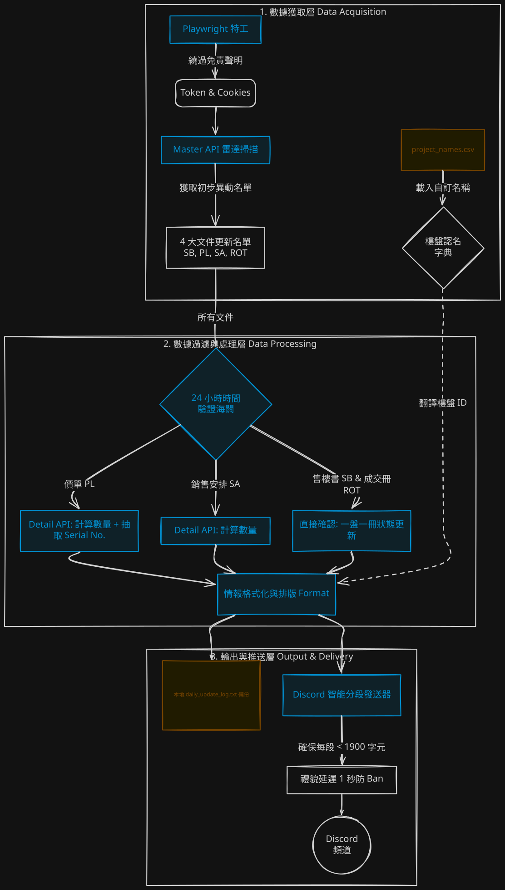
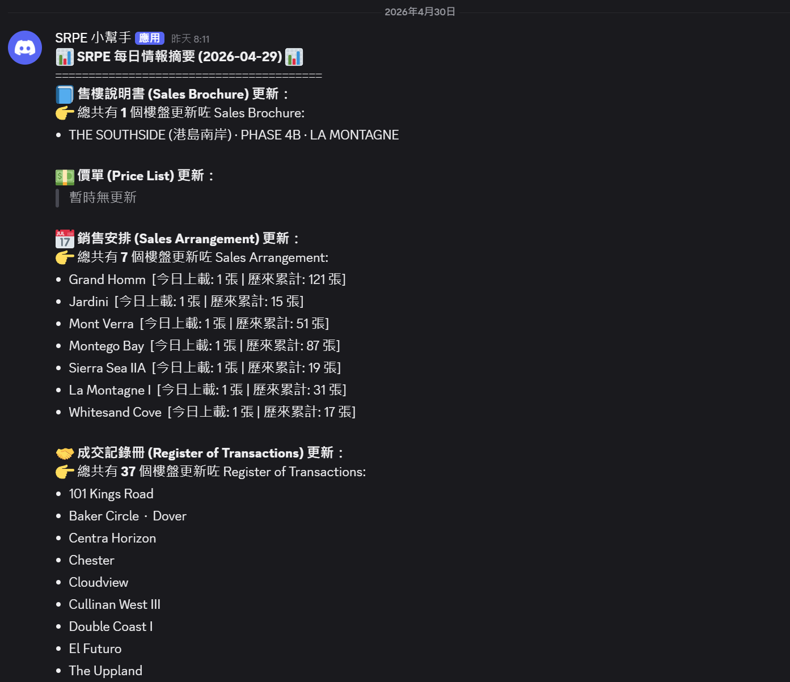

# 📡 SRPE Daily Intelligence Radar (一手住宅物業銷售資訊雷達)


An automated data pipeline that monitors, scrapes, and parses the Sales of First-hand Residential Properties Electronic Platform (SRPE) in Hong Kong, delivering real-time formatted intelligence reports directly to Discord.

## 📖 項目簡介 (Project Overview)
本項目旨在自動化追蹤香港一手住宅物業市場的最新動態。系統會每日自動登入 SRPE 網站，掃描並過濾過去 24 小時內上載的四類核心文件：
* **售樓說明書 (Sales Brochure)**
* **價單 (Price List)**
* **銷售安排 (Sales Arrangement / SA)**
* **成交記錄冊 (Register of Transactions / ROT)**

系統會將收集到的原始數據進行清洗、格式化，並透過 Discord Webhook 推送結構化的高管級摘要報告，大幅減省人手查閱時間。

## ✨ 核心功能 (Key Features)
* **🔐 自動化權限獲取**：利用 `playwright` 模擬無頭瀏覽器 (Headless Browser) 行為，自動處理並繞過政府網站的免責聲明頁面以獲取 API Token。
* **🤖 智能 PDF 數據提取**：深度定制 `pdfplumber`，獨創「混合雙打抽取法 (Hybrid Strategy)」解決政府 PDF 格式不一的問題：
  * **動態策略切換**：自動偵測表格是否具備底線，靈活切換 `lines` 與 `text` 解析策略。
  * **虛擬封底技術 (Virtual Explicit Lines)**：修復發展商漏畫表格底線導致的數據流失問題。
  * **極端邊角案例處理**：精準解析「子母座 (e.g., Tower 1A of Tower 1)」、過濾街道地址 (避免誤認為座數)，以及智能生成洋房/別墅的縮寫 (e.g., Ocean Villa -> OV)。
* **✉️ Discord 智能分段推送**：內置分段發送器 (Message Chunker)，自動將長篇報告安全切割，完美繞過 Discord 的 2000 字元限制。
* **🗂️ 樓盤名稱自訂映射**：支援讀取 `project_names.csv`，將生硬的樓盤 ID 自動轉換為易讀的自訂中英文名稱。

## 📝 系統架構 (Architecture Diagram)


## 🛠️ 技術棧 (Tech Stack)
* **Language:** Python
* **Web Scraping & API:** `requests`, `playwright`, `asyncio`
* **Data Processing:** `pdfplumber`, `re` (Regular Expressions)
* **Notification:** Discord Webhooks

## 🚀 安裝與執行 (Getting Started)

### 1. 安裝依賴套件 (Install Dependencies)
```bash
pip install requests playwright pdfplumber nest_asyncio
playwright install chromium
```

### 2. 環境設定 (Configuration)
1. 準備一個 `project_names.csv` 文件於專案根目錄，用作樓盤名稱映射，格式如下：

    ```csv
    id,custom_name
    123,Hava
    456,Allegro
    ```

2. 設定 Discord Webhook 環境變數。為安全起見，請勿將 Token 硬編碼於腳本中：
   * **Windows (PowerShell):** `$env:DISCORD_WEBHOOK_URL="your_webhook_url"`
   * **Mac/Linux:** `export DISCORD_WEBHOOK_URL="your_webhook_url"`

### 3. 執行程式 (Run the Radar)
    python main.py

## 📊 報告輸出範例 (Sample Output)

推送至 Discord 的實時情報會自動套用 Markdown 格式，清晰區分各類文件及上載詳情：



## 🗺️ 未來規劃 (Roadmap)
- [ ] **NLP 支付條款解析**：運用 Text Mining 萃取價單「支付條款 (Terms)」內的實際折實價 (Net Price) 及折扣率。
- [ ] **數據庫整合**：將洗淨後的 DataFrame 匯入 SQL / MongoDB，建立歷史數據倉儲 (Data Warehouse)。
- [ ] **BI 視覺化儀表板**：連接 PowerBI 或 Tableau，將每日情報轉換為實時數據圖表供管理層參考。
- [ ] **自動化部署**：將腳本容器化 (Docker)，並部署至 AWS/GCP 透過 CRON Job 每日定時自動觸發。    
